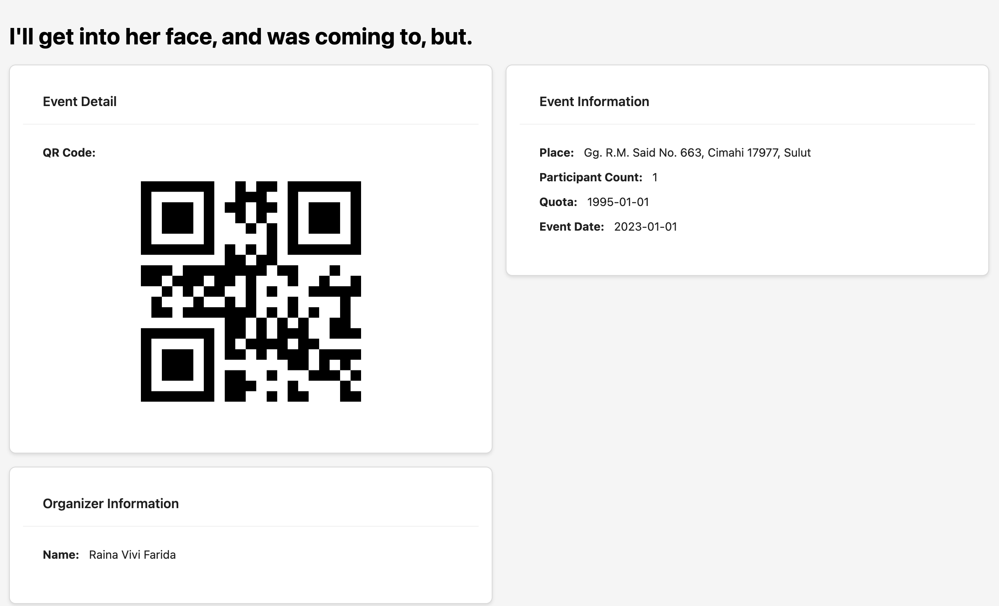

# Event App
The Event App is a versatile application designed to allow users to view, register for events, and more. The app provides a user-friendly platform with functionalities that cater to various aspects of event engagement. Users can seamlessly explore, register for, and participate in events through a streamlined and intuitive interface.

# Tech Stacks

React-Vite, Redux, Antd Frameworks

# How to use it

git clone / download -> npm install -> npm run dev

# Login

The Login Interface is a user interface specifically designed to facilitate the user authentication process within a system or platform. This interface provides elements that allow users to enter their credentials, such as a username and password, to gain legitimate access.

A description of the Login Interface typically includes several key elements:

- **Username:** An input box for entering the username or email address of the user.
- **Password:** An input box for entering the user's secret and encrypted password.
- **Login Button:** A button used to submit login information to the system.

# Registration

The Register Interface is a user interface specifically designed to facilitate the user registration process within a system or platform. This interface provides elements that allow users to create a new account by entering necessary information such as personal details, email address, and password.

Key components of a Register Interface typically include:

- **Username/Full Name:**Input fields for users to enter their chosen username or full name.
- **Email Address:** An input field to enter a valid email address.
- **Password:** Input field for creating a secure and confidential password.
- **Confirm Password:** A second input field to confirm the entered password.

# Browse Event List

The "Browse Event List" feature provides users with a comprehensive view of available events through a user-friendly table interface. The table is designed to display key information about each event in a structured format, enhancing the user's ability to quickly scan and identify events of interest.

## Table Structure

The table consists of columns that present essential details about each event, such as the event name, date, location, and any other pertinent information. Additionally, there is a dedicated "Action" column that includes an option for viewing event details.

## Event Details Action

Within the "Action" column, users can find a "View Details" button or link associated with each event entry. Clicking on this action initiates a seamless process, allowing users to delve deeper into specific event information. This detailed view may include event descriptions, schedules, participant lists, and any other relevant details that provide a comprehensive overview of the selected event.
